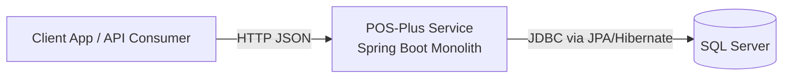
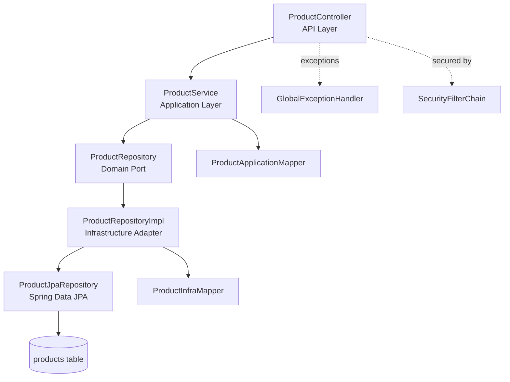
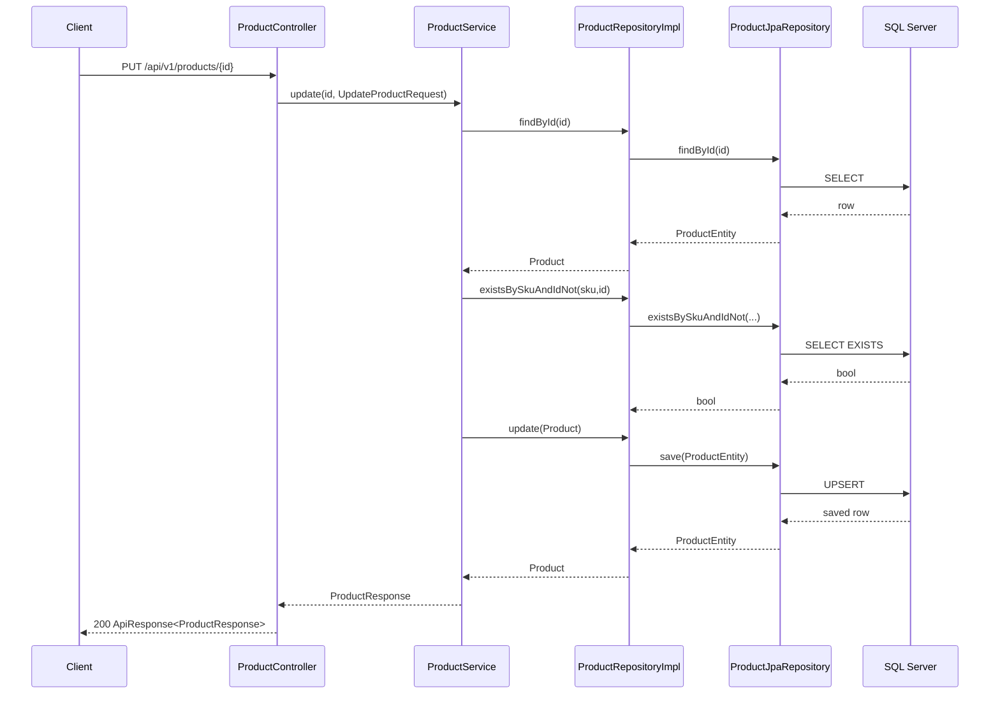

# Project Architecture Blueprint

Generated on: 2026-04-27  
Repository: `pos-plus`  
Detail level: Implementation-ready (based on current code)

## 1. Architecture Detection and Analysis

### Detected technology stack
- **Language/runtime**: Java 25 (`build.gradle`)
- **Framework**: Spring Boot 4.0.6 (`build.gradle`)
- **Build tool**: Gradle (`build.gradle`, `settings.gradle`)
- **Persistence**: Spring Data JPA + Hibernate + SQL Server JDBC (`build.gradle`)
- **API style**: REST over HTTP (`src/main/java/com/soft/pos_plus/api/controllers/ProductController.java`)
- **Security library**: Spring Security (`src/main/java/com/soft/pos_plus/infrastructure/config/SecurityConfig.java`)
- **Validation**: manual service-layer validation + global exception mapping (not Bean Validation annotations in DTOs)

### Detected architectural pattern
- **Primary pattern**: Layered monolith with Clean/Hexagonal influences.
- **Evidence of layering**:
  - `api` (controllers, HTTP error handling)
  - `application` (use-case service, DTOs, mappers, app-level exceptions)
  - `domain` (entity + repository/service contracts)
  - `infrastructure` (JPA entity/repository implementation, security config)
- **Hexagonal influence**: domain repository interface (`domain.repositories.ProductRepository`) with infrastructure adapter implementation (`infrastructure.persistence.sqlserver.product.ProductRepositoryImpl`).
- **Not fully strict**: `domain.services.IProductService` depends on application DTOs, creating inward-outward coupling.

## 2. Architectural Overview

The system is a **single deployable Spring Boot service** exposing a product CRUD API. The architecture separates HTTP concerns, application orchestration, domain contracts, and persistence adapters. Dependency injection is provided by Spring through stereotype annotations and constructor injection.

### Guiding principles observed
- Keep web/transport concerns in controller + global handler.
- Keep persistence technology behind domain repository abstractions.
- Use mapper classes for representation conversion between layers.
- Centralize business orchestration in application service.

### Architectural boundaries and enforcement
- Package boundaries communicate intent, but enforcement is currently **convention-based**, not automated.
- Spring component scanning and constructor injection define runtime wiring.
- No static architecture tests (for example ArchUnit) are present to enforce dependency rules.

### Hybrid/adapted pattern notes
- This is not pure Clean Architecture because the domain service interface imports application DTOs.
- It is not pure DDD either (anemic domain model, business rules mostly in service layer).

## 3. Architecture Visualization (C4-style)

### 3.1 System context (Level 1)


### 3.2 Container/component view (Level 2/3)


### 3.3 Request/data flow for update operation


## 4. Core Architectural Components

### API layer (`api`)
- **Purpose**: expose REST endpoints and map HTTP requests/responses.
- **Structure**: `ProductController`, `GlobalExceptionHandler`, `ApiResponse` wrapper.
- **Interaction**: controller delegates to application service; exception handler normalizes error payloads.
- **Evolution**: add new controllers by feature (`/api/v1/<resource>`), reuse `ApiResponse`, reuse global handler patterns.

### Application layer (`application`)
- **Purpose**: orchestrate use cases and enforce business/application rules.
- **Structure**: `ProductService`, DTOs, mappers, custom exceptions.
- **Interaction**: consumes domain repository contract; converts between DTO and domain entity.
- **Evolution**: add use-case-specific services and keep transport models (DTOs) isolated from domain entities.

### Domain layer (`domain`)
- **Purpose**: define core business model and ports.
- **Structure**: `Product` entity, `ProductRepository` interface, `IProductService` interface.
- **Interaction**: ports consumed by application, implemented by infrastructure.
- **Evolution**: migrate validation/invariants into domain model/value objects for stronger consistency.

### Infrastructure layer (`infrastructure`)
- **Purpose**: provide technology-specific adapters (JPA, SQL Server, security config).
- **Structure**: JPA entity, Spring Data repository, port implementation, infra mapper, security config.
- **Interaction**: implements domain repository via `ProductRepositoryImpl`; persistence mapping isolated in `ProductInfraMapper`.
- **Evolution**: add new adapters (for example NoSQL or messaging) behind domain ports.

## 5. Architectural Layers and Dependencies

### Implemented layer map
- `api` -> `application`
- `application` -> `domain`
- `infrastructure` -> `domain` (implements ports)
- `infrastructure` <-> Spring framework and external DB

### Expected dependency rules
- Domain should be independent of application/infrastructure/framework.
- Application should depend on domain contracts and abstractions.
- Infrastructure should depend on domain contracts and external frameworks.
- API should depend on application contracts, not infrastructure internals.

### Violations and risks found
- **Layer violation**: `domain.services.IProductService` imports application DTOs (`CreateProductRequest`, `UpdateProductRequest`, `ProductResponse`), which couples domain to application representations.
- **Validation split**: request validation is mostly in `ProductService` and not in request DTO annotations, making transport contract less self-documenting.

### DI patterns in use
- Constructor injection via Lombok `@RequiredArgsConstructor`.
- Spring stereotypes (`@Service`, `@Repository`, `@Component`, `@RestController`) for bean registration.

## 6. Data Architecture

### Domain model structure
- Core aggregate-like entity: `domain.entities.Product`.
- Current model is mutable and anemic (getters/setters, no domain behavior methods).

### Persistence model and mapping
- Persistence entity: `infrastructure.entities.ProductEntity` mapped to `products` table.
- Domain <-> persistence translation via `ProductInfraMapper`.
- Request/response <-> domain translation via `ProductApplicationMapper`.

### Data access patterns
- Port + adapter repository pattern:
  - Port: `domain.repositories.ProductRepository`
  - Adapter: `infrastructure.persistence.sqlserver.product.ProductRepositoryImpl`
  - Data access backend: `ProductJpaRepository extends JpaRepository`

### Relationships and aggregation
- Single entity model currently; no explicit multi-entity aggregate boundaries.

### Validation and integrity
- Required fields and business constraints enforced in `ProductService`:
  - non-empty `name`, `sku`
  - `price > 0`
  - `stock >= 0`
  - unique SKU checks through repository existence methods

### Caching
- No explicit caching strategy detected (no Spring Cache annotations/config).

## 7. Cross-Cutting Concerns Implementation

### Authentication and authorization
- Implemented by Spring Security filter chain (`SecurityConfig`).
- Current policy permits all requests (`auth.anyRequest().permitAll()`), which effectively disables authorization.
- CSRF disabled, suitable for stateless APIs in many cases but should be revisited with real auth.

### Error handling and resilience
- Centralized exception-to-HTTP mapping through `GlobalExceptionHandler`.
- Custom exception taxonomy: bad request, conflict, not found.
- No retries, circuit breakers, timeouts, or fallback patterns currently.

### Logging and monitoring
- No explicit application logging strategy detected (for example structured logs, correlation IDs, tracing).
- SQL logging enabled via JPA settings (`spring.jpa.show-sql=true`).

### Validation
- Manual validation in service methods.
- Handler for `MethodArgumentNotValidException` exists, but DTOs currently do not define Jakarta validation annotations.

### Configuration management
- Properties-based config in `src/main/resources/application.properties`.
- Environment profile strategy not yet visible (single properties file).
- Sensitive values (DB credentials) currently in plaintext properties; should be externalized.

## 8. Service Communication Patterns

- **Boundary definition**: REST endpoints under `/api/v1/products`.
- **Protocol/format**: HTTP + JSON.
- **Sync/async**: synchronous in-process call chain only.
- **Versioning**: URI-based (`v1` path segment).
- **Service discovery**: none (single-process monolith).
- **Inter-service resilience**: not applicable yet (no remote service calls).

## 9. Java/Spring-Specific Architectural Patterns

### Application bootstrap and container model
- Entrypoint via `@SpringBootApplication` in `PosPlusApplication`.
- Spring IoC handles wiring using component scanning and constructor injection.

### Dependency injection framework usage
- Standard Spring stereotypes + constructor DI pattern with Lombok.

### Transaction boundaries
- No explicit `@Transactional` usage detected in read files; repository save operations rely on Spring Data defaults.
- As business complexity grows, explicit transactional demarcation at use-case methods is recommended.

### ORM configuration and usage
- Hibernate DDL auto-update enabled (`spring.jpa.hibernate.ddl-auto=update`).
- JPA entity annotations define schema constraints (`nullable`, `unique`, `length`, precision/scale).

### API implementation style
- Annotation-driven MVC controllers (`@RestController`, `@RequestMapping`, method mappings).
- Standardized response envelope with success/error factory methods.

## 10. Implementation Patterns

### Interface design patterns
- Repository contract in domain, adapter implementation in infrastructure.
- Service contract currently in domain but typed with application DTOs; refactor option below.

### Service implementation pattern
- Template in `ProductService`:
  1. validate required fields and business constraints,
  2. query repository for state/uniqueness,
  3. map DTO -> domain,
  4. persist through port,
  5. map domain -> response DTO.

### Repository implementation pattern
- Adapter composes Spring Data JPA repo + mapper.
- Save/update are both `jpaRepository.save(entity)`.
- Existence checks delegated to derived query methods (`existsBy...`).

### Controller/API implementation pattern
- Controller methods return `ResponseEntity<ApiResponse<T>>`.
- Messages standardized (“created successfully”, etc.).
- HTTP status semantics align to operation type (201 create, 200 others).

### Domain model implementation pattern
- POJO + Lombok accessors with timestamps and mutable state.
- Business invariants are externalized to service layer.

## 11. Testing Architecture

- Current test coverage is minimal (`PosPlusApplicationTests` asserts true).
- No unit tests for service logic, mapper tests, repository integration tests, or controller contract tests detected.
- Test profile excludes datasource/JPA auto-config (`src/test/resources/application.properties`).

### Recommended testing boundaries
- **Unit**: `ProductService` validation, SKU conflict behavior, not-found paths.
- **Mapper tests**: `ProductApplicationMapper`, `ProductInfraMapper` conversion correctness.
- **Integration**: repository adapter + JPA mappings with testcontainers SQL Server or in-memory alternative with compatible semantics.
- **API tests**: MockMvc tests for status codes and response envelope consistency.

## 12. Deployment Architecture

- Current topology implies single Spring Boot process connected to SQL Server.
- No Dockerfile, compose, Kubernetes manifests, or CI workflows detected.
- Runtime config currently local properties based; no explicit secret manager integration.

### Deployment implications
- Suitable for local/dev and early-stage environments.
- For production readiness, define environment-specific config, secret injection, health checks, and deployment automation.

## 13. Extension and Evolution Patterns

### Feature addition patterns
- Add new feature module by layering:
  - `api/controllers/<Feature>Controller`
  - `application/services/<Feature>Service`
  - `application/dtos/*`
  - `domain/entities` and/or `domain/repositories` ports
  - `infrastructure/...` adapters (JPA repo/entity/mapper)
- Keep data contracts (DTO) separate from domain entities.
- Introduce new repository methods at port interface first, then implement in adapter.

### Modification patterns
- Preserve `ApiResponse` contract for backward compatibility.
- Evolve endpoints with `/api/v2` or additive response fields when possible.
- Maintain DB compatibility using migration tooling before replacing `ddl-auto=update`.

### Integration patterns
- For external systems, add outbound port in domain/application and adapter in infrastructure.
- Keep anti-corruption mapping isolated in dedicated adapter mapper classes.
- Add resilience (timeouts/retries/circuit breakers) at adapter boundary.

## 14. Architectural Pattern Examples

### Layer separation (port + adapter)
```java
// domain port
public interface ProductRepository {
    Product save(Product product);
    Optional<Product> findById(UUID id);
}

// infrastructure adapter
@Repository
@RequiredArgsConstructor
public class ProductRepositoryImpl implements ProductRepository {
    private final ProductJpaRepository jpaRepository;
    private final ProductInfraMapper mapper;
}
```
Source: `src/main/java/com/soft/pos_plus/domain/repositories/ProductRepository.java`, `src/main/java/com/soft/pos_plus/infrastructure/persistence/sqlserver/product/ProductRepositoryImpl.java`

### Component communication (controller -> service)
```java
@PostMapping
public ResponseEntity<ApiResponse<ProductResponse>> create(@RequestBody CreateProductRequest request) {
    ProductResponse data = productService.create(request);
    return ResponseEntity.status(HttpStatus.CREATED)
        .body(ApiResponse.success("Product created successfully", data));
}
```
Source: `src/main/java/com/soft/pos_plus/api/controllers/ProductController.java`

### Mapping-based boundary isolation
```java
public Product toDomain(CreateProductRequest request) {
    Product product = new Product();
    product.setId(UUID.randomUUID());
    // ... map fields
    return product;
}
```
Source: `src/main/java/com/soft/pos_plus/application/mappers/ProductApplicationMapper.java`

## 15. Architectural Decision Records (Inferred)

### ADR-001: Use layered monolith with Spring Boot
- **Context**: Need a simple CRUD backend with quick development speed.
- **Decision**: Use Spring Boot monolith with package-based layers.
- **Consequences**:
  - Positive: fast iteration, simple deployment.
  - Negative: architectural drift risk without automated boundary checks.

### ADR-002: Use domain repository ports + JPA adapter
- **Context**: Desire to avoid hard-coupling business flow to Spring Data interfaces.
- **Decision**: Define `ProductRepository` in domain and implement via infrastructure adapter.
- **Consequences**:
  - Positive: better testability and persistence swap flexibility.
  - Negative: extra mapping code and boilerplate.

### ADR-003: Standardized response envelope
- **Context**: Need consistent API responses for success/error.
- **Decision**: Use generic `ApiResponse<T>` and centralized exception handler.
- **Consequences**:
  - Positive: client consistency, predictable contracts.
  - Negative: can obscure raw HTTP semantics if overused.

### ADR-004: Service-layer manual validation
- **Context**: Enforce rules near use-case logic.
- **Decision**: Implement required-field and constraint checks in `ProductService`.
- **Consequences**:
  - Positive: explicit business checks in one place.
  - Negative: duplicated concerns with transport validation opportunities; weaker schema self-documentation.

## 16. Architecture Governance

### Current governance posture
- Architecture is governed by package conventions and developer discipline.
- No automated architecture checks or static dependency rules detected.
- No explicit architecture decision log in-repo detected.

### Recommended governance controls
- Add ArchUnit rules for layer dependency direction.
- Add PR checklist items for boundary compliance and mapping placement.
- Introduce ADR folder (`docs/adr`) and require updates for major structural decisions.
- Add quality gates: unit + integration tests for new use cases.

## 17. Blueprint for New Development

### Development workflow by feature type
1. Define use case and API contract (request/response DTOs).
2. Add/extend domain model and repository port if needed.
3. Implement application service orchestration and validations.
4. Implement/extend infrastructure adapter and mapping.
5. Add controller endpoint and exception mapping behavior.
6. Add tests by layer (service, mapper, repository, controller).

### Implementation templates

#### New domain repository port
```java
public interface InventoryRepository {
    Optional<InventoryItem> findBySku(String sku);
    InventoryItem save(InventoryItem item);
}
```

#### New application service
```java
@Service
@RequiredArgsConstructor
public class InventoryService {
    private final InventoryRepository inventoryRepository;

    public InventoryResponse create(CreateInventoryRequest request) {
        // validate
        // map
        // persist
        // return response
        return new InventoryResponse();
    }
}
```

#### New infrastructure adapter
```java
@Repository
@RequiredArgsConstructor
public class InventoryRepositoryImpl implements InventoryRepository {
    private final InventoryJpaRepository jpaRepository;
    private final InventoryInfraMapper mapper;
}
```

### Common pitfalls to avoid
- Importing application DTOs inside domain interfaces/entities.
- Bypassing domain ports from application layer directly to Spring Data repos.
- Mixing transport and domain validation responsibilities unpredictably.
- Expanding controllers with business logic instead of delegating to services.
- Keeping secrets in source-controlled property files.

### Update strategy for this blueprint
- Refresh this document on each major feature/module addition or boundary refactor.
- Tie blueprint updates to ADR updates and release milestones.

---

## Immediate Architecture Improvements (Prioritized)

1. Decouple `domain.services.IProductService` from application DTOs (move interface to application or redefine with domain types).
2. Add Bean Validation annotations to request DTOs and keep domain/business invariants in service/domain model.
3. Replace plaintext DB credentials with environment variables or secret manager integration.
4. Introduce architecture tests (ArchUnit) for layer dependency rules.
5. Expand automated tests across service/repository/controller boundaries.
